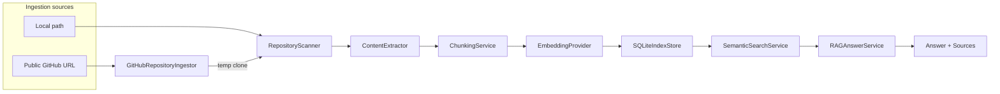

# AI Repository Assistant

**Status: Portfolio v1 complete after M9.**

AI Repository Assistant is a backend-first RAG system that lets users index local or public GitHub repositories and ask source-grounded questions about the codebase.

It scans readable files, chunks them, generates embeddings through provider abstractions, persists indexes in SQLite, retrieves relevant chunks with semantic search, and returns answers with citations.

## Why this project matters

Built as a portfolio project for **Backend / AI Applications Engineer** roles. It demonstrates:

- Clean FastAPI layered architecture (routes, schemas, domain, services)
- End-to-end RAG pipeline with citations
- Semantic search over code chunks
- Provider abstraction (OpenAI, Gemini, fake) for embeddings and LLMs
- SQLite persistence and index management
- Dockerized local development
- Safe public GitHub ingestion
- A CLI demo that exercises the real HTTP API

## Key features

- Local repository scanning and indexing
- Public GitHub repository ingestion by URL
- Sensitive file exclusion (`.env`, keys, credentials)
- Content extraction and line-based chunking with character-length safeguards
- Embeddings via OpenAI, Gemini, or fake providers
- Semantic search with `source_type` and `include_tests` filtering
- RAG answers with source citations
- SQLite persistence across API restarts
- Index list / get / delete endpoints
- Docker Compose setup for reproducible local runs
- CLI demo: `scripts/demo_github.py`

## Architecture overview

GitHub ingestion is a **source adapter**. After clone, it reuses the same indexing pipeline as local paths.



**Layers:** `api/routes` (HTTP) → `services` (business logic) → `domain` / `utils` / `core`. Persistence goes through an `IndexStore` protocol implemented by `SQLiteIndexStore`.

## Quickstart (recommended: Docker)

Docker is for **local development and reproducible execution**, not production deployment.

```bash
git clone <repository-url>
cd ai-repository-assistant
cp .env.example .env   # Windows: copy .env.example .env
docker compose up --build
```

API: `http://127.0.0.1:8000` · Docs: `http://127.0.0.1:8000/docs`

`.env.example` defaults to fake providers so you can demo without paid API keys.

### SQLite in Docker

Compose sets `SQLITE_DB_PATH=/app/data/ai_repository_assistant.db` and bind-mounts `./data:/app/data`. Indexes survive container restarts as long as `./data` is kept on the host.

### Local setup (without Docker)

Requires Python 3.11+.

```bash
python -m venv .venv
# Windows: .venv\Scripts\activate
# macOS/Linux: source .venv/bin/activate
pip install -r requirements.txt
cp .env.example .env
uvicorn app.main:app --reload
```

## Run the demo

The demo script is an **external HTTP client**. The API must already be running. It does not import internal services. The demo flow has been manually verified with fake providers and OpenAI providers.

```bash
# Terminal 1 — start API (Docker or uvicorn)
docker compose up --build

# Terminal 2 — run demo
python scripts/demo_github.py --url https://github.com/laralopez17/BooksRecommender --question "What does this project do?"
```

Optional:

```bash
python scripts/demo_github.py --url https://github.com/laralopez17/BooksRecommender --question "Where is the recommendation logic implemented?" --api-base-url http://127.0.0.1:8000 --top-k 3
```

**What it does:** health → `index-github` → search → ask → list indexes. Prints `index_id`, chunk count, embedding model, top hits (path, score, source type, lines), answer, and sources.

To use OpenAI or Gemini instead of fake providers, set `EMBEDDING_PROVIDER` / `LLM_PROVIDER` and API keys in `.env`, then restart the API.

## API examples

Interactive docs: `http://127.0.0.1:8000/docs`

| Method | Path                         | Purpose                   |
| ------ | ---------------------------- | ------------------------- |
| `POST` | `/repositories/index`        | Index a local path        |
| `POST` | `/repositories/index-github` | Index a public GitHub URL |
| `POST` | `/repositories/search`       | Semantic search           |
| `POST` | `/repositories/ask`          | RAG answer with citations |
| `GET`  | `/repositories/indexes`      | List persisted indexes    |

```bash
curl -X POST http://127.0.0.1:8000/repositories/index-github -H "Content-Type: application/json" -d '{"url": "https://github.com/owner/repo"}'

curl -X POST http://127.0.0.1:8000/repositories/search -H "Content-Type: application/json" -d '{"index_id": "YOUR_INDEX_ID", "query": "Where is chunking implemented?", "top_k": 3, "include_tests": false}'

curl -X POST http://127.0.0.1:8000/repositories/ask -H "Content-Type: application/json" -d '{"index_id": "YOUR_INDEX_ID", "question": "Where is chunking implemented?", "top_k": 3, "include_tests": false}'

curl http://127.0.0.1:8000/repositories/indexes
```

Local path indexing (host path, or `/workspace` when using Docker’s default mount):

```bash
curl -X POST http://127.0.0.1:8000/repositories/index -H "Content-Type: application/json" -d '{"path": "/workspace"}'
```

Also available: `GET /health`, `POST /repositories/scan`, `POST /repositories/chunks`, `GET|DELETE /repositories/indexes/{index_id}`.

## Configuration

Copy `.env.example` to `.env`. Never commit `.env`.

| Variable                 | Default                             | Description                               |
| ------------------------ | ----------------------------------- | ----------------------------------------- |
| `EMBEDDING_PROVIDER`     | `fake` in `.env.example`            | `fake`, `openai`, or `gemini`             |
| `LLM_PROVIDER`           | `fake` in `.env.example`            | `fake`, `openai`, or `gemini`             |
| `MAX_CHUNKS_TO_EMBED`    | `50`                                | Cap before embedding API calls            |
| `MAX_CHARS_PER_CHUNK`    | `12000`                             | Split oversized line windows before embed |
| `SQLITE_DB_PATH`         | `./data/ai_repository_assistant.db` | Overridden in Docker Compose              |
| `OPENAI_API_KEY`         | empty                               | Required for OpenAI providers             |
| `OPENAI_EMBEDDING_MODEL` | `text-embedding-3-small`            | OpenAI embedding model                    |
| `OPENAI_CHAT_MODEL`      | `gpt-4.1-mini`                      | OpenAI chat model                         |
| `GEMINI_API_KEY`         | empty                               | Required for Gemini providers             |
| `GEMINI_EMBEDDING_MODEL` | `gemini-embedding-001`              | Gemini embedding model                    |
| `GEMINI_CHAT_MODEL`      | `gemini-2.0-flash`                  | Gemini chat model                         |

## Testing

```bash
pytest
```

- Fake embedding and LLM providers
- Temporary SQLite databases (never `./data/ai_repository_assistant.db`)
- No real GitHub, OpenAI, or Gemini network calls
- Docker not required for tests

## Security and safety

- Sensitive files (`.env`, `*.pem`, `*.key`, credentials) are excluded at scan time
- Cloned GitHub repos are treated as untrusted; files are read, never executed
- Only HTTPS `github.com/owner/repo` URLs; no `shell=True`
- Temporary clones are cleaned up after indexing
- `MAX_CHUNKS_TO_EMBED` and `MAX_CHARS_PER_CHUNK` limit embedding cost and input size
- OpenAI quota/billing issues map to HTTP `402` with a clear message

## Design decisions / trade-offs

| Decision                       | Why                                                           |
| ------------------------------ | ------------------------------------------------------------- |
| SQLite instead of a vector DB  | Local-first v1; simple persistence without ops overhead       |
| Python cosine similarity       | Enough for small indexes; avoids pgvector for portfolio scope |
| Provider protocols + factories | Swap OpenAI / Gemini / fake without changing indexer or RAG   |
| Fake providers                 | Deterministic tests and free local demos                      |
| GitHub as source adapter       | One indexing pipeline; no duplicated scan/chunk/embed logic   |
| Docker for local DX only       | Reproducible runs, not production deployment                  |
| Char limit, not tokenizer      | Prevents oversized embeds without tiktoken dependency         |

## Limitations

- Public GitHub repositories only (no auth / private repos)
- No branch selection
- No UI
- No cloud deployment
- No incremental reindexing
- No ANN / dedicated vector database
- SQLite / local-first only
- For GitHub indexes, `repository_path` may reflect a temporary clone path; `github_url` is the meaningful source identifier

## Future work

Optional post-v1 improvements (not required for portfolio completeness):

- Private repos, GitHub tokens / GitHub App
- Branch selection and incremental reindexing
- Postgres + pgvector or a vector DB
- In-memory cache for hot indexes
- Cloud deployment and CI/CD
- UI
- Agents / MCP

## Project structure

```
app/           FastAPI app, routes, services, domain, schemas
tests/         pytest suite (fake providers, temp SQLite)
scripts/       demo_github.py (HTTP client demo)
Dockerfile
docker-compose.yml
PROJECT_NOTES.md   Engineering notes and milestone history
PORTFOLIO_NOTES.md Interview pitch and CV bullets
```

## Milestones (v1)

| Milestone | Focus                                    |
| --------- | ---------------------------------------- |
| M1        | FastAPI backend, scanner, file filtering |
| M2        | Content extraction, chunking             |
| M3        | Embeddings, semantic search              |
| M4        | RAG answering with citations             |
| M5        | SQLite persistence, index management     |
| M6        | Docker + developer experience            |
| M7        | Public GitHub ingestion                  |
| M8        | CLI demo + chunk size safeguard          |
| M9        | Portfolio polish + v1 closure            |

See `PROJECT_NOTES.md` for detailed engineering notes and `PORTFOLIO_NOTES.md` for interview / CV wording.
